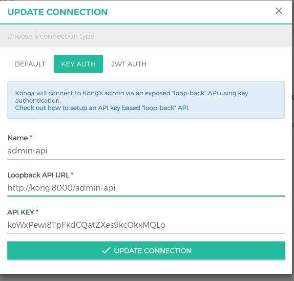

# Guya E-commerce & Express With Microservices

[](https://github.com/Simonbelte/Guya)


## Contents

1. [Introduction](#introduction)
    * [Architectures](architectures)
        * [Microservice Architecture](#microservice-architecture)
        * [The Clean Architecture](#the-clean-architecture)
        * [BEM](#bem)
    * [Technologies Stack](technologies-stack)
        * [Elastic stack (ELK)](#elk)
        * [Pattern Lab](#pattern-lab)
        * [Bits.dev](#bits.dev)
        * [Storybook](#storybook)
        * [Customized Json Web Token (jwt)](#jwt)
2. [Requirements](#requirements)
3. [Core Structure](#core-structure)
4. [Integration](integration)
    * [Git](#git)
    * [Git Actions](#git-actions)
    * [Travis Ci](travis-ci)
    * [Okteto](#Okteto)
    * [Docker Hub](#docker-hub)
    * [bits.dev](#bits.dev)
    * [Npm](#npm)
    * [Packagist](#packagist)
5. [REST API Guideline](#rest-api-guideline)
6. [Setup Konga Admin UI](#setup-konga-admin-ui)
    * [Setup Konga LoopBack](#setup-konga-loopBack)
    * [Enable Key Auth Plugin](#enable-key-auth-plugin)
    * [Add Konga as Consumer](#add-konga-as-consumer)
    * [Create API key for Konga](#create-aPI-key-for-konga)
    * [Setup Connection](#setup-connection)
7. [Elastic stack (ELK) Services](#elk-service)
    * [Initial setup](#initial-setup)
        * [Disable Default Quota](#elk-quota)
        * [Setting up user authentication](#setting-up-user-authentication)
        * [Injecting data](#injecting-data)
        * [Default Kibana index pattern creation](#default-kibana-index-pattern-creation)
    * [Configuration](#configuration)
        * [How to configure Elasticsearch](#how-to-configure-elasticsearch)
        * [How to configure Kibana](#how-to-configure-kibana)
        * [How to configure Logstash](#how-to-configure-logstash)
        * [How to disable paid features](#how-to-disable-paid-features)
    * [Extensibility](#extensibility)
        * [How to add plugins](#how-to-add-plugins)
        * [How to enable the provided extensions](#how-to-enable-the-provided-extensions)
    * [JVM tuning](#jvm-tuning)
        * [How to specify the amount of memory used by a service](#how-to-specify-the-amount-of-memory-used-by-a-service)
        * [How to enable a remote JMX connection to a service](#how-to-enable-a-remote-jmx-connection-to-a-service)
    * [Going further](#going-further)
        * [Using a newer stack version](#using-a-newer-stack-version)
        * [Plugins and integrations](#plugins-and-integrations)
        * [Swarm mode](#swarm-mode)

## Introduction

### Architectures

#### Microservice Architecture
#### The Clean Architecture
#### BEM

### Technologies Stack

#### Elastic stack (ELK)
Elastic stack (ELK) gives you the ability to analyze any data set by using the searching/aggregation capabilities of Elasticsearch and the visualization power of kibana.

Based on the offical Docker images form Elastic:
* [Elasticsearch](https://github.com/elastic/elasticsearch/tree/master/distribution/docker)
* [Logstash](https://github.com/elastic/logstash/tree/master/docker)
* [Kibana](https://github.com/elastic/kibana/tree/master/src/dev/build/tasks/os_packages/docker_generator)

#### Elastic stack (ELK)
#### Pattern Lab
#### Bits.dev
#### Storybook
#### Customized Json Web Token (jwt)


## Requirements


## Core Structure
Core structure files and folders ended up with the following concepts:

* Everything related to docker is placed in a `.docker` directory on on the same level as the main application

* In this directory 
    * each service gets its own subdirectory for configuration is a `.shared` folder containing scripts and configuration required by multiple services
    * is an `.env.example` file containing variables for the docker-compose.yml
    * is a `docker-test.sh` file containing high level tests to validate the docker containers
    * a `Makefile` with common instructions to control Docker is placed in the repository root


## Setup Konga Admin UI

`Konga` provide GUI for interacting with `Kong` Admin API.

Konga would ask you to configure some credentials (`Username` + `Password`) that required to access Konga Web. 
After that they going to prompt how we want to communicate with Kong there's 3 available option:

* Default (Not Recommended): `Konga` would access the Kong Admin API directly
* Key Auth (Recommended): `Konga` would access Kong Admin API that run behind Kong (Loop-Back API) using configured Api Key.
* JWT (Recommended): `Konga` would access Kong Admin API that run behind Kong (Loop-Back API) using JWT by using shared key and secrets.

In this project we use the second method using Key Auth. Before we setup connection let's go back to access our Kong Admin API. Currently Kong Admin API is publicly accessible for those anyone who has access to the url which is dangerous for production environment. Now we need to protect Kong Admin API by running it behind Kong using LoopBack.

### Setup Konga LoopBack

With Kong's routing design it's possible to serve Admin API itself behind Kong proxy.

To configure this we need to following steps:

* Add Kong Admin API as services

```console
$ curl --location --request POST 'http://localhost:8001/services/' \
--header 'Content-Type: application/json' \
--data-raw '{
    "name": "admin-api",
    "host": "localhost",
    "port": 8001
}'
```

* Add Admin API route: To register route on Admin API Services we need either service name or service id, you can replace the following command below:

```console
$ curl --location --request POST 'http://localhost:8001/services/{service_id|service_name}/routes' \
--header 'Content-Type: application/json' \
--data-raw '{
    "paths": ["/admin-api"]
}'
```

Now our Kong Admin API is running behind Kong Proxy, so in order to access it you need to :

```console
$ curl localhost:8000/admin-api/
```

### Enable Key Auth Plugin

Our Admin API already run behind kong, but is not secured yet. In order to protect Kong Admin API we need to enable key auth plugin at service level by doing this commands.

```console
$ curl -X POST http://localhost:8001/services/{service_id|service_name}/plugins \
    --data "name=key-auth"
```

### Add Konga as Consumer

Our Admin API already run behind kong, but is not secured yet. In order to protect Kong Admin API we need to enable key auth plugin at service level by doing this commands.

Replace `{custom_id}` with any key for example `custom_id=cebd360d-3de6-4f8f-81b2-31575fe9846a`

```console
$ curl --location --request POST 'http://localhost:8001/consumers/' \
--form 'username=konga' \
--form 'custom_id={custom_id}'
```

### Create API key for Konga

Using Consumer ID that generated when we're adding consumer, we will use that Consumer ID and generate API Key.

From the above output get `id` and replace `cid` below for example `cid` looks like `e7b420e2-f200-40d0-9d1a-a0df359da56e`:

```console
$ curl --location --request POST 'http://localhost:8001/consumers/{cid}/key-auth'
```

### Setup Connection

Now we're already have all required component to setup Konga connection



Remember in picture above, because Kong and Konga are in the same network they can simply reach each other by using container name.

## Elastic stack (ELK) Service

### Initial setup

#### Disable Default Quota

By default, Elasticsearch installed with homebrew on Linux goes into read-only mode when you have less than 5% of free disk space. If you see errors similar to this:

```console
$ curl -XPUT -u elastic:elastic_pass -H "Content-Type: application/json" http://localhost:9200/_cluster/settings -d '{ "transient": { "cluster.routing.allocation.disk.threshold_enabled": false } }'
```

```console
$ curl -XPUT -u elastic:elastic_pass -H "Content-Type: application/json" http://localhost:9200/_all/_settings -d '{"index.blocks.read_only_allow_delete": null}'
```

#### Setting up user authentication

> :information_source: Refer to [How to disable paid features](#how-to-disable-paid-features) to disable authentication.

The stack is pre-configured with the following **privileged** bootstrap user:

* user: *elastic*
* password: *elastic_pass*

Although all stack components work out-of-the-box with this user, we strongly recommend using the unprivileged [built-in
users][builtin-users] instead for increased security.

1. Initialize passwords for built-in users

```console
$ docker-compose exec -T elasticsearch bin/elasticsearch-setup-passwords auto --batch
```

Passwords for all 6 built-in users will be randomly generated. Take note of them.

2. Unset the bootstrap password (_optional_)

Remove the `ELASTIC_PASSWORD` environment variable from the `elasticsearch` service inside the Compose file
(`docker-compose.yml`). It is only used to initialize the keystore during the initial startup of Elasticsearch.

3. Replace usernames and passwords in configuration files

Use the `kibana` user inside the Kibana configuration file (`kibana/config/kibana.yml`) and the `logstash_system` user
inside the Logstash configuration file (`logstash/config/logstash.yml`) in place of the existing `elastic` user.

Replace the password for the `elastic` user inside the Logstash pipeline file (`logstash/pipeline/logstash.conf`).

> :information_source: Do not use the `logstash_system` user inside the Logstash *pipeline* file, it does not have
> sufficient permissions to create indices. Follow the instructions at [Configuring Security in Logstash][ls-security]
> to create a user with suitable roles.

See also the [Configuration](#configuration) section below.

4. Restart Kibana and Logstash to apply changes

```console
$ docker-compose restart kibana logstash
```

> :information_source: Learn more about the security of the Elastic stack at [Tutorial: Getting started with
> security][sec-tutorial].

#### Injecting data

Give Kibana about a minute to initialize, then access the Kibana web UI by hitting
[http://localhost:5601](http://localhost:5601) with a web browser and use the following default credentials to log in:

* user: *elastic*
* password: *\<your generated elastic password>*

Now that the stack is running, you can go ahead and inject some log entries. The shipped Logstash configuration allows
you to send content via TCP:


```console
# Using BSD netcat (Debian, Ubuntu, MacOS system, ...)
$ cat /path/to/logfile.log | nc -q0 localhost 5000
```

```console
# Using GNU netcat (CentOS, Fedora, MacOS Homebrew, ...)
$ cat /path/to/logfile.log | nc -c localhost 5000
```

You can also load the sample data provided by your Kibana installation.

#### Default Kibana index pattern creation

When Kibana launches for the first time, it is not configured with any index pattern.

##### Via the Kibana web UI

> :information_source: You need to inject data into Logstash before being able to configure a Logstash index pattern via
the Kibana web UI.

Navigate to the _Discover_ view of Kibana from the left sidebar. You will be prompted to create an index pattern. Enter
`logstash-*` to match Logstash indices then, on the next page, select `@timestamp` as the time filter field. Finally,
click _Create index pattern_ and return to the _Discover_ view to inspect your log entries.

Refer to [Connect Kibana with Elasticsearch][connect-kibana] and [Creating an index pattern][index-pattern] for detailed
instructions about the index pattern configuration.

##### On the command line

Create an index pattern via the Kibana API:

```console
$ curl -XPOST -D- 'http://localhost:5601/api/saved_objects/index-pattern' \
    -H 'Content-Type: application/json' \
    -H 'kbn-version: 7.6.0' \
    -u elastic:<your generated elastic password> \
    -d '{"attributes":{"title":"logstash-*","timeFieldName":"@timestamp"}}'
```

The created pattern will automatically be marked as the default index pattern as soon as the Kibana UI is opened for the first time.


### Configuration

> :information_source: Configuration is not dynamically reloaded, you will need to restart individual components after
any configuration change.

#### How to configure Elasticsearch

The Elasticsearch configuration is stored in [`.docker/elasticsearch/config/elasticsearch.yml`][config-es].

You can also specify the options you want to override by setting environment variables inside the Compose file:

```yml
elasticsearch:

  environment:
    network.host: _non_loopback_
    cluster.name: my-cluster
```

Please refer to the following documentation page for more details about how to configure Elasticsearch inside Docker
containers: [Install Elasticsearch with Docker][es-docker].

#### How to configure Kibana

The Kibana default configuration is stored in [`.docker/kibana/config/kibana.yml`][config-kbn].

It is also possible to map the entire `config` directory instead of a single file.

Please refer to the following documentation page for more details about how to configure Kibana inside Docker
containers: [Running Kibana on Docker][kbn-docker].

#### How to configure Logstash

The Logstash configuration is stored in [`.docker/logstash/config/logstash.yml`][config-ls].

It is also possible to map the entire `config` directory instead of a single file, however you must be aware that
Logstash will be expecting a [`log4j2.properties`][log4j-props] file for its own logging.

Please refer to the following documentation page for more details about how to configure Logstash inside Docker
containers: [Configuring Logstash for Docker][ls-docker].

#### How to disable paid features

Switch the value of Elasticsearch's `xpack.license.self_generated.type` option from `trial` to `basic` (see [License
settings][trial-license]).

### Extensibility

#### How to add plugins

To add plugins to any ELK component you have to:

1. Add a `RUN` statement to the corresponding `Dockerfile` (eg. `RUN logstash-plugin install logstash-filter-json`)
2. Add the associated plugin code configuration to the service configuration (eg. Logstash input/output)
3. Rebuild the images using the `docker-compose build` command

#### How to enable the provided extensions

A few extensions are available inside the [`extensions`](extensions) directory. These extensions provide features which
are not part of the standard Elastic stack, but can be used to enrich it with extra integrations.

The documentation for these extensions is provided inside each individual subdirectory, on a per-extension basis. Some
of them require manual changes to the default ELK configuration.

### JVM tuning

#### How to specify the amount of memory used by a service

By default, both Elasticsearch and Logstash start with [1/4 of the total host
memory](https://docs.oracle.com/javase/8/docs/technotes/guides/vm/gctuning/parallel.html#default_heap_size) allocated to
the JVM Heap Size.

The startup scripts for Elasticsearch and Logstash can append extra JVM options from the value of an environment
variable, allowing the user to adjust the amount of memory that can be used by each component:

| Service       | Environment variable |
|---------------|----------------------|
| Elasticsearch | ES_JAVA_OPTS         |
| Logstash      | LS_JAVA_OPTS         |

To accomodate environments where memory is scarce (Docker for Mac has only 2 GB available by default), the Heap Size
allocation is capped by default to 256MB per service in the `docker-compose.yml` file. If you want to override the
default JVM configuration, edit the matching environment variable(s) in the `docker-compose.yml` file.

For example, to increase the maximum JVM Heap Size for Logstash:

```yml
logstash:

  environment:
    LS_JAVA_OPTS: -Xmx1g -Xms1g
```

#### How to enable a remote JMX connection to a service

As for the Java Heap memory (see above), you can specify JVM options to enable JMX and map the JMX port on the Docker
host.

Update the `{ES,LS}_JAVA_OPTS` environment variable with the following content (I've mapped the JMX service on the port
18080, you can change that). Do not forget to update the `-Djava.rmi.server.hostname` option with the IP address of your
Docker host (replace **DOCKER_HOST_IP**):

```yml
logstash:

  environment:
    LS_JAVA_OPTS: -Dcom.sun.management.jmxremote -Dcom.sun.management.jmxremote.ssl=false -Dcom.sun.management.jmxremote.authenticate=false -Dcom.sun.management.jmxremote.port=18080 -Dcom.sun.management.jmxremote.rmi.port=18080 -Djava.rmi.server.hostname=DOCKER_HOST_IP -Dcom.sun.management.jmxremote.local.only=false
```

### Going further

#### Plugins and integrations

> :Insert

#### Swarm mode

> : Under Development

Experimental support for Docker [Swarm mode][swarm-mode] is provided in the form of a `docker-stack.yml` file, which can
be deployed in an existing Swarm cluster using the following command:

```console
$ docker stack deploy -c docker-stack.yml elk
```

If all components get deployed without any error, the following command will show 3 running services:

```console
$ docker stack services elk
```

> :information_source: To scale Elasticsearch in Swarm mode, configure *zen* to use the DNS name `tasks.elasticsearch`
instead of `elasticsearch`.


chmod 700 get_helm.sh


kubectl create -f namespaces.yml

## Monitoring

### Edit Prometheus service

Since prometheus & grafana services are available within a cluster (ClusterIP is the default Kubernetes service), therefore they can not be accessed outside of cluster.

In order to access the web GUI from outside of cluster, on our local machine we need to change default ClusterIP services to NodePort (Kubernetes transparently routes incoming traffic on the NodePort to your service).


```bash
$ export EDITOR=vim

$ kubectl edit -n guya-ltd-monitoring service/prometheus-operator-{randNum}-prometheus
```

and change `type: ClusterIp` to `type: NodePort`

## REST API Guideline

### Pagination

| Name | Type  | Default value  | Description  |
|---|---|---|---|
|  `Page` | `integer | string`   | `1` |  Page Number |
| `limit`  |  `integer | string` |  `10` | Number of rows |

Example:

```bash
$ curl http://api.example.com/paths?page=4&limit=10
```

### Ordering

It is possible to order the results by 1 or more keys using order_by(). The order may be specified by prepending each of the keys by “+” or “-”. Ascending order is assumed if there’s no prefix.:

| Name | Type | Default value | Description |
|---|---|---|---|
| `order_by` | `array` | `null` | List of fields to order |

Example:

```bash
$ curl http://api.example.com/paths?order_by=name,+age,-job
```

### Filtering

Filtering follows `{column name}={operator name}:{value}`

Operator name list:

* `ne` – not equal to
* `lt` – less than
* `lte` – less than or equal to
* `gt` – greater than
* `gte` – greater than or equal to
* `not` – negate a standard check, may be used before 
* `in` – value is in list (a list of values should be provided)
* `nin` – value is not in list (a list of values should be provided)
* `mod` – value % x == y, where x and y are two provided values
* `all` – every item in list of values provided is in array
* `size` – the size of the array is
* `exists` – value for field exists

Example:

```bash
$ curl http://api.example.com/paths?age=ge:18&name=abebe
```

### Status Code usage

* `200` Ok, usage `GET`, `/api/v1/items`, `/api/v1/items/12`
* `201` No Content
* `401` Unauthorized
* `403` Forbidden
* `400` Not Found
* `400` Bad Request, `ALL`

### Api Response Guide


```javascript
    HTTP/1.1 200
    Content-Type: application/json

{
    status_code: 200,
    status: "OK",
    message: "All items retrived",
    error: {
        message: "Error Message",
        type: "ValueError",
        code: 2500,
        trace_id: "dsfsf"
        ...
    },
    error: {
        email: {
            message: "Error Message",
            type: "ValueError",
            code: 2500,
            trace_id: "dsfsf"
            ...
        }
    }
    pagination: {
        count: 100,
        limit: 10,
        page: 2
    },
    // For Multi
    data: [
        {},
    ],
    // Single item
    data: {
        id: "id"
        name: "User",
        created_at: ""
    }
}
```

### Api Sending Request

```javascript
{
    username: "User one",
    password: "password"
}
```

[elk-stack]: https://www.elastic.co/elk-stack
[stack-features]: https://www.elastic.co/products/stack
[paid-features]: https://www.elastic.co/subscriptions
[trial-license]: https://www.elastic.co/guide/en/elasticsearch/reference/current/license-settings.html

[linux-postinstall]: https://docs.docker.com/install/linux/linux-postinstall/

[booststap-checks]: https://www.elastic.co/guide/en/elasticsearch/reference/current/bootstrap-checks.html
[es-sys-config]: https://www.elastic.co/guide/en/elasticsearch/reference/current/system-config.html

[win-shareddrives]: https://docs.docker.com/docker-for-windows/#shared-drives
[mac-mounts]: https://docs.docker.com/docker-for-mac/osxfs/

[builtin-users]: https://www.elastic.co/guide/en/elasticsearch/reference/current/built-in-users.html
[ls-security]: https://www.elastic.co/guide/en/logstash/current/ls-security.html
[sec-tutorial]: https://www.elastic.co/guide/en/elasticsearch/reference/current/security-getting-started.html

[connect-kibana]: https://www.elastic.co/guide/en/kibana/current/connect-to-elasticsearch.html
[index-pattern]: https://www.elastic.co/guide/en/kibana/current/index-patterns.html

[config-es]: ./elasticsearch/config/elasticsearch.yml
[config-kbn]: ./kibana/config/kibana.yml
[config-ls]: ./logstash/config/logstash.yml

[es-docker]: https://www.elastic.co/guide/en/elasticsearch/reference/current/docker.html
[kbn-docker]: https://www.elastic.co/guide/en/kibana/current/docker.html
[ls-docker]: https://www.elastic.co/guide/en/logstash/current/docker-config.html

[log4j-props]: https://github.com/elastic/logstash/tree/7.6/docker/data/logstash/config
[esuser]: https://github.com/elastic/elasticsearch/blob/7.6/distribution/docker/src/docker/Dockerfile#L23-L24

[upgrade]: https://www.elastic.co/guide/en/elasticsearch/reference/current/setup-upgrade.html

[swarm-mode]: https://docs.docker.com/engine/swarm/